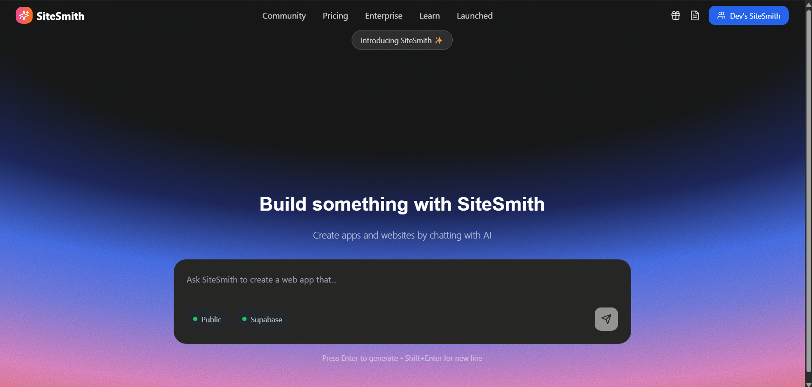
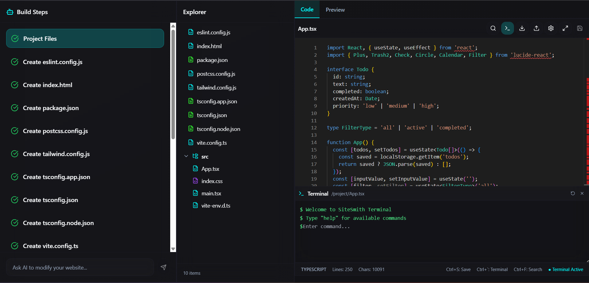
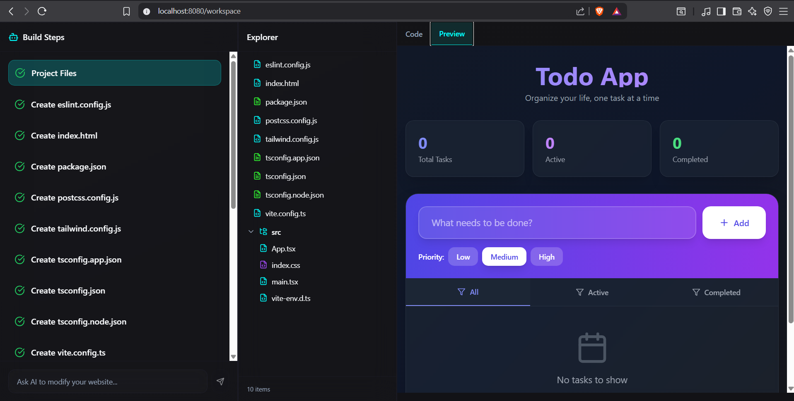

# �️ SiteSmith - AI-Powered Web Development IDE

> Transform ideas into functional web applications through conversational AI

SiteSmith is an innovative web-based IDE that leverages Claude AI to generate complete web applications from natural language descriptions. It provides a full-stack development environment with real-time code generation, live preview, and WebContainer integration for instant deployment.

## ✨ Key Features

### 🤖 AI-Driven Development
- **Intelligent Project Type Detection**: Automatically determines whether to create React or Node.js projects
- **Conversational Code Generation**: Chat with Claude AI to generate, modify, and enhance your code
- **Step-by-Step Guidance**: AI breaks down complex tasks into manageable build steps
- **Template-Based Scaffolding**: Pre-configured templates for React and Node.js applications

### 💻 Integrated Development Environment
- **Monaco Code Editor**: Full-featured editor with syntax highlighting, IntelliSense, and error detection
- **Built-in Terminal**: Execute commands directly in the browser environment
- **File Explorer**: Navigate and manage your project structure
- **Live Preview**: See changes instantly with WebContainer integration
- **Tabbed Interface**: Switch between code editing and live preview modes

### 🔧 WebContainer Integration
- **Browser-Based Runtime**: Run Node.js applications directly in the browser
- **Real-time File System**: Dynamic file creation and modification
- **Live Reload**: Instant updates as you modify your code
- **Full Stack Support**: Both frontend and backend development capabilities

## 🖼️ Screenshots

### Main Interface - AI-Powered Prompt

*Beautiful gradient interface where you describe your project to AI*

### Development Environment - Full IDE Experience

*Complete IDE with Monaco editor, file explorer, terminal, and step-by-step guidance*

### Live Preview - Real-time Results

*Instant preview of your generated application with WebContainer integration*

## 🏗️ Technical Architecture

### Backend API Server
- **Express.js**: RESTful API with TypeScript support
- **Claude AI Integration**: Anthropic's Claude model for code generation
- **Template Management**: Dynamic project scaffolding system
- **CORS Enabled**: Cross-origin resource sharing for frontend integration

### Frontend Application
- **React 18**: Modern functional components with hooks
- **TypeScript**: Full type safety across the application
- **Vite**: Lightning-fast development server and build tool
- **Shadcn/UI**: Beautiful, accessible component library
- **Tailwind CSS**: Utility-first styling framework

### Core Components
- **ChatPanel**: AI conversation interface with step tracking
- **CodeEditor**: Monaco-based editor with advanced features
- **FileExplorer**: Tree-view file navigation system
- **PreviewFrame**: WebContainer-powered live preview
- **Terminal**: Browser-based command execution

## 🚀 Getting Started

### Prerequisites
- Node.js 18+ and npm/yarn
- Anthropic API key for Claude AI integration

### Installation & Setup

1. **Clone and Install Dependencies**
   ```bash
   git clone https://github.com/debashish17/Sitesmith.git
   cd Sitesmith
   
   # Install backend dependencies
   cd backend
   npm install
   
   # Install frontend dependencies
   cd ../frontend
   npm install
   ```

2. **Environment Configuration**
   ```bash
   # In backend directory
   cp .env.example .env
   # Add your Anthropic API key:
   # ANTHROPIC_API_KEY=your_key_here
   ```

3. **Start Development Servers**
   ```bash
   # Terminal 1 - Backend API (Port 3000)
   cd backend
   npm run dev
   
   # Terminal 2 - Frontend App (Port 5173)
   cd frontend
   npm run dev
   ```

4. **Access the Application**
   Open `http://localhost:5173` and start building!

## 📋 How It Works

### 1. Project Initialization
- Enter a natural language description of your desired application
- Claude AI analyzes the prompt and determines the appropriate technology stack
- System generates initial project structure and configuration files

### 2. AI-Guided Development
- Chat interface provides step-by-step build instructions
- Each step creates, modifies, or configures specific files
- Visual progress tracking shows completion status

### 3. Live Development Environment
- Monaco editor provides professional-grade code editing
- WebContainer enables real-time execution and preview
- Integrated terminal allows package installation and script execution

### 4. Real-time Preview
- Instant feedback as you modify code
- Full-stack application preview in the browser
- Hot reload functionality for rapid iteration

## � Project Structure

```
SiteSmith/
├── assets/                           # Screenshots and media
│   ├── main-interface.png           # Landing page screenshot
│   ├── ide-view.png                 # IDE interface screenshot
│   └── live-preview.png             # Preview functionality screenshot
│
├── backend/                          # Node.js Express API
│   ├── src/
│   │   ├── index.ts                 # Main server file
│   │   ├── prompts.ts               # AI system prompts
│   │   ├── constants.ts             # Application constants
│   │   ├── stripIndent.ts           # String formatting utilities
│   │   └── default/                 # Project templates
│   │       ├── react.ts             # React project template
│   │       └── node.ts              # Node.js project template
│   ├── package.json
│   ├── tsconfig.json
│   └── .env.example                 # Environment variables template
│
├── frontend/                         # React Vite Application
│   ├── src/
│   │   ├── components/
│   │   │   ├── ui/                  # Shadcn UI components
│   │   │   └── workspace/           # IDE components
│   │   │       ├── ChatPanel.tsx   # AI chat interface
│   │   │       ├── CodeEditor.tsx  # Monaco editor wrapper
│   │   │       ├── FileExplorer.tsx # File tree navigation
│   │   │       ├── PreviewFrame.tsx # WebContainer preview
│   │   │       ├── TabView.tsx     # Tab switching interface
│   │   │       └── Terminal.tsx    # Browser terminal
│   │   ├── pages/
│   │   │   ├── Chat.tsx            # Landing page
│   │   │   ├── Workspace.tsx       # Main IDE interface
│   │   │   └── NotFound.tsx        # 404 error page
│   │   ├── hooks/
│   │   │   └── useWebcontainer.ts  # WebContainer integration
│   │   ├── types/
│   │   │   └── index.ts            # TypeScript definitions
│   │   ├── lib/                    # Utility functions
│   │   ├── config.ts               # App configuration
│   │   ├── steps.ts                # Step parsing logic
│   │   └── App.tsx                 # Main app component
│   ├── components.json             # Shadcn UI configuration
│   ├── package.json
│   ├── vite.config.ts
│   ├── tailwind.config.ts
│   ├── tsconfig.json
│   ├── tsconfig.app.json
│   └── tsconfig.node.json
│
├── README.md                        # Project documentation
└── .gitignore                       # Git ignore rules
```

## 🛠️ Technology Stack

### Core Technologies
- **Frontend**: React 18, TypeScript, Vite
- **Backend**: Node.js, Express, TypeScript
- **AI**: Anthropic Claude (claude-sonnet-4-5)
- **Runtime**: WebContainer API for browser-based execution

### UI & Styling
- **Component Library**: Shadcn/UI with Radix UI primitives
- **Styling**: Tailwind CSS with custom glass morphism effects
- **Icons**: Lucide React icon library
- **Editor**: Monaco Editor (VS Code's editor)

### Development Tools
- **State Management**: React hooks and context
- **HTTP Client**: Axios for API communication
- **Routing**: React Router for navigation
- **Build Tool**: Vite for fast development and building

## 🎯 Use Cases

- **Rapid Prototyping**: Quickly generate functional web applications
- **Learning Tool**: Understand project structure and best practices
- **Code Generation**: AI-assisted development workflow
- **Educational Platform**: Interactive coding environment
- **Template Creation**: Generate boilerplate code for common patterns

## 🤝 Contributing

We welcome contributions! Here's how you can help:

1. **Fork** the repository
2. **Create** a feature branch (`git checkout -b feature/amazing-feature`)
3. **Commit** your changes (`git commit -m 'Add amazing feature'`)
4. **Push** to the branch (`git push origin feature/amazing-feature`)
5. **Open** a Pull Request

### Development Guidelines
- Follow TypeScript best practices
- Maintain component modularity
- Write descriptive commit messages
- Test changes thoroughly before submitting

## � License

This project is licensed under the MIT License - see the [LICENSE](LICENSE) file for details.

## � Links

- **Repository**: [GitHub](https://github.com/debashish17/Sitesmith)
- **Issues**: [Bug Reports & Feature Requests](https://github.com/debashish17/Sitesmith/issues)
- **Discussions**: [Community Forum](https://github.com/debashish17/Sitesmith/discussions)

---

**Built with ❤️ for developers who love AI-powered productivity**
